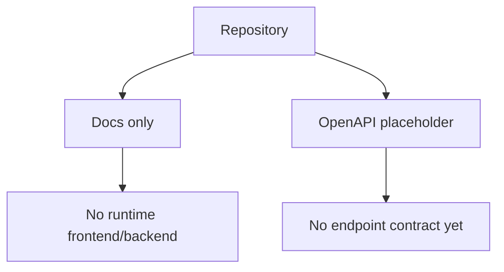
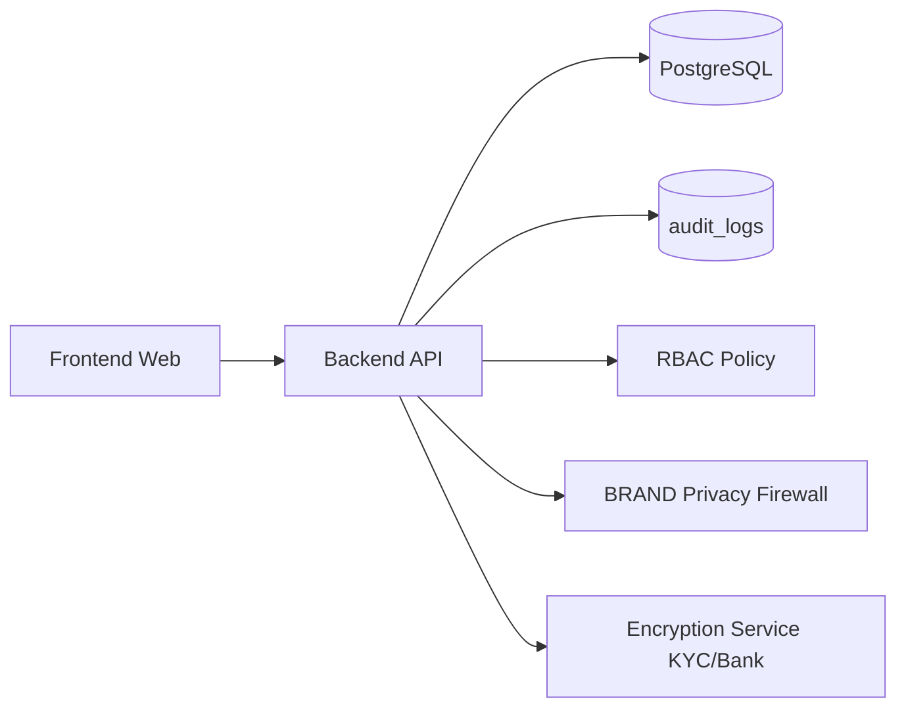

# Architecture Audit & Blueprint

## 1) Current Architecture (As-Is)

Repository audit findings (current branch state):

- **Frontend**: no frontend application exists (no route definitions, no components, no pages).
- **Backend**: no backend service exists (no controllers, no route handlers, no endpoint implementation).
- **Database**: no schema/migration tooling exists (no migration files, no ORM models, no SQL DDL).
- **Auth/RBAC**: no authentication, sessions, tokens, role model, or policy middleware is present.
- **OpenAPI**: placeholder contract exists at `openapi/openapi.yaml` with empty `paths`.
- **Operational tooling**: no runtime lint/build/test pipeline for app code exists yet.

### Current System Diagram

## 2) Proposed Target Architecture (To-Be)

### 2.1 Monorepo Layout

- `apps/api` - backend REST service
- `apps/web` - frontend application
- `packages/shared` - shared types/validation/policy helpers
- `db/migrations` - SQL migrations
- `openapi/openapi.yaml` - API source-of-truth
- `docs/*` - architecture, flows, controls, rollout plans

### 2.2 Backend Layers

- **Transport**: HTTP controllers + request validation.
- **Application services**: business workflows (KYC, bank, payout, review).
- **Policy layer**: RBAC and privacy firewall (role-aware output shaping).
- **Data layer**: repositories and transaction boundaries.
- **Audit layer**: append-only `audit_logs` for sensitive actions.

### 2.3 Security/Compliance Controls

- Roles: `SUPER_ADMIN`, `BRAND`, `PARTNER`, `USER`.
- BRAND privacy firewall: strict redaction of user PII in every BRAND-facing response.
- Sensitive data encryption at rest: KYC + bank fields encrypted before persistence.
- Masking in UI/API: bank/account identifiers shown masked, last-4 only where applicable.
- Sensitive action auditing: immutable audit trail for KYC/bank changes, approvals/rejections, payouts.

### 2.4 Proposed Domain Model (High-Level)

- **Identity/Auth**: `users`, `roles`, `user_roles`, sessions/tokens.
- **Compliance**: `kyc_profiles`, `kyc_documents`, `kyc_reviews`.
- **Payments**: `bank_accounts`, `payout_requests`, `payout_events`.
- **Audit**: `audit_logs` with actor, action, resource, before/after, timestamp.

### 2.5 Target System Diagram

