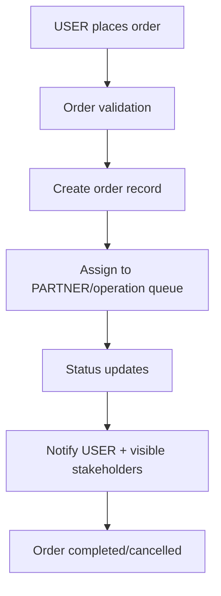
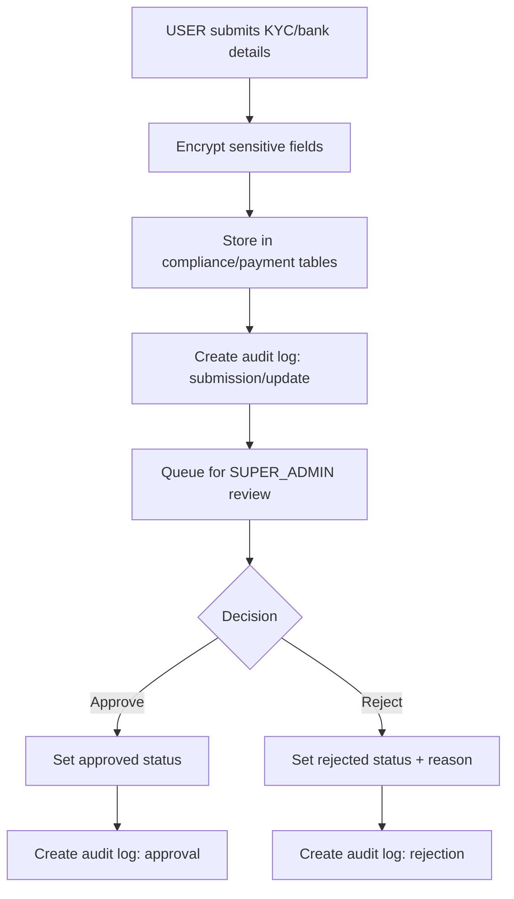
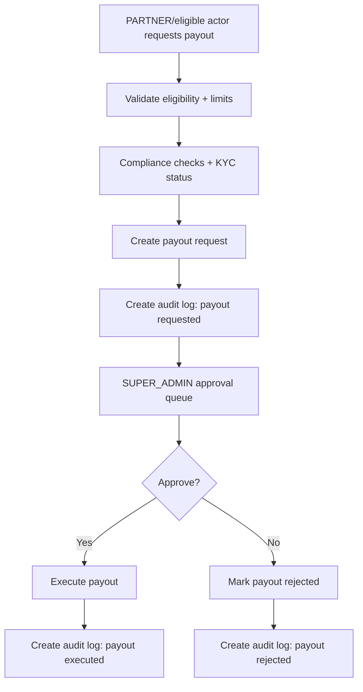

# Core Product Flows (Target)

> These diagrams represent the intended product behavior to implement incrementally from PR-1 onward.

## 1) Order Flow

## 2) Review Flow (KYC / Sensitive Review)

## 3) Payout Flow

